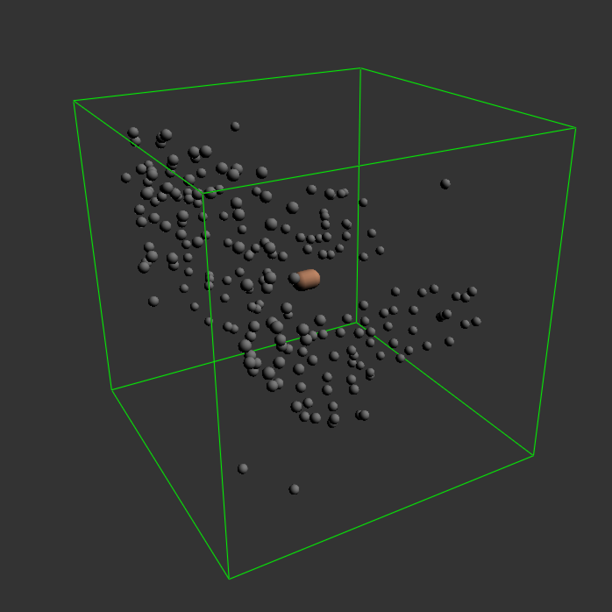

# tsne-adventure

**NB: This project is yet to be properly cleaned and documented**

A demonstrative video of this project is hosted on Vimeo: [https://vimeo.com/418516597](https://vimeo.com/418516597). The below shows a visualisation of the controller and the samples.

The repository contains the necessary code to get going to reproduce the results. It requires [Max 8](https://cycling74.com/products/max-features) and python 3 to be installed on your computer, and [Sensors2OSC](https://sensors2.org/) on your Android phone. There are multiple `pip` dependencies that needs to be installed as well, which can be seen in the top of the relevant scripts.

## Setup

Before opening the Max patch, you need to generate some coordinates from t-SNE. Running `tsne.py --input_dir <folder>` with a folder of .wav samples returns a JSON file `coordinates.json`. This file is in turn used to generate the visualisation and sonification of the patch. Run `sensors.py --tsne_file coordinates.json`  to set up a server. Your IP and relevant port should be printed to your console, which are the values you need to configure in Sensors2OSC. To make sure that everything is up and runnning, you can uncomment some of the print function in `sensors.py`.

In Max, open the patch `visualisation.maxpat`. If everything works, the graphs should start to show the sensors values that are sent from Sensors2OSC, as in the video. Note that the Max patch uses some objects from the [CNMAT odot external library](http://cnmat.berkeley.edu/downloads).

In case you just want to record some accelerometer data, you can use `record.py`. This generates a TSV file after a specified number of measurements.